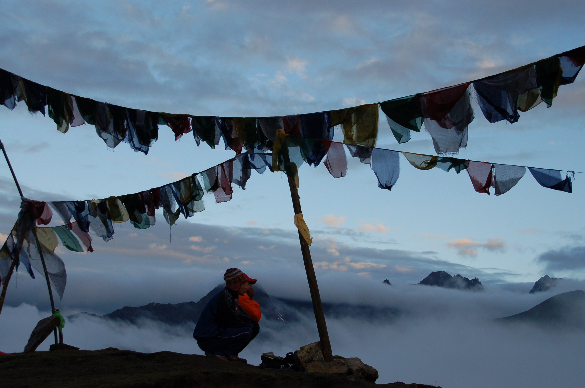

##### My research interests are broadly focused on understanding the factors governing the distribution, abundance, and biodiversity of marine species ranging from phytoplankton to apex predators and at scales ranging from mesoscale to global. Some of these topics include:
- ##### How predator-prey dynamics and community stability vary within and across ecosystems and in response to varying environmenal and human influences.
- ##### Understanding the patterns, drivers, and consequences of marine populations change over the past century.
- ##### Explaining how and why biodiversity is changing over time and across space and what the consequences of these changes are.

##### I address these questions using statistical analysis, field-based approaches, and experimentation (see below). 

_ _ _
######  *Macroecology:* I apply statistical models and methodologies to better understand ecological patterns and processes that occur over large spatial and temporal scales in the ocean. Such macroecological approaches provide a means to understand and test the generality of ecological dynamics that often cannot be resolved using smaller-scale experimental or field-based approaches. Example of this work: To understand the impacts of ocean warming on global patterns of species richness for tunas and billfishes, I synthesized the temperature preferences for all individual species from published studies in order to construct a statistical model to predict global patterns of richness from temperature. I then used estimates of species richness from 50 years Japanese fishing catches to assess that accuracy of the predicted patters across the global ocean.  
_ _ _

######   *Experimentation:* Large-scale macroecological approaches are not amenable to controlled manipulation which is the hallmark of experimentation. Experimentation is well suited to resolving cause-and-effect ecologcial dynamics. Example of this: To understand the effects of ocean warming on marine plankton communities, we conducted a 6 week mesocosm experiment in Kiel, Germany. 12 individual plankton ecosystems were established within 1500 liter mesocosms, for which temperature and nutrient levels were manipulated. The experimental manipulations were based on the future ocean conditions predicted from an ocean general circulation model, and the plankton species were collected via field-based sampling from the Baltic Sea. As such, this study represented a unique integration of theoretical, field-based, statistical, and experimental approaches.

_ _ _
######  *Observational field-based research*: Some research questions require us to get away from the computer or lab and do what 99% of the population thinks marine biologists do every day... get out on (and in) the ocean. Example of work: To understand the factors influencing the factors influencing the recovery (or lack thereof) of the Galapagos grouper (Bacalao), I collected underwater samples with an international team of researchers based at the Charles Darwin Research Station, in the Galapagos Islands. Several weeks were spent visually surveying the island chain for Bacalao, and additional measurements are being integrated into a bioeconomic model to assess the recovery potential for the species. 

##Photos

Below are a few photos from here and there. 
    

### Contact me:

[danielgboyce@gmail.com](mailto:danielgboyce@gmail.com)

[flickr]: https://www.flickr.com/photos/127552234@N03/